# Windows Forms sample

This sample demonstrates using SSO through AAD in a Windows Forms application.
In order to use this sample you will have to perform a number of steps.

## Setup

To support SSO a new application needs to be added to the tenant that will be used to authenticate the user.

### _Login to the [Azure portal](https://portal.azure.com) and go to `App registrations`_

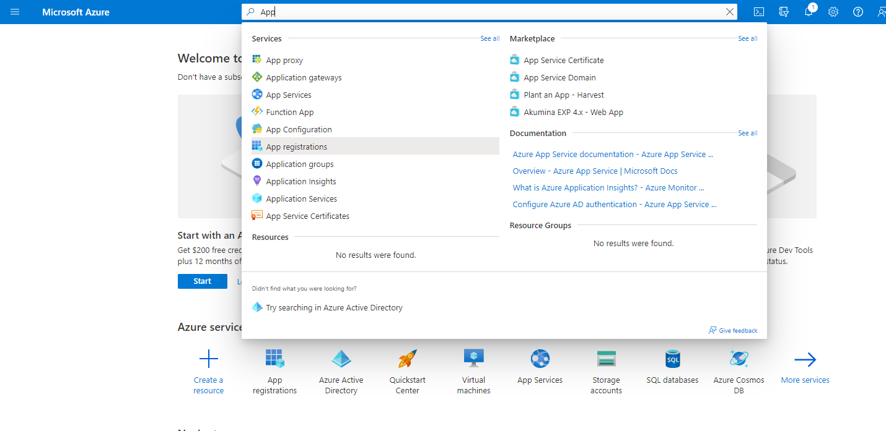

### _Register a new application_

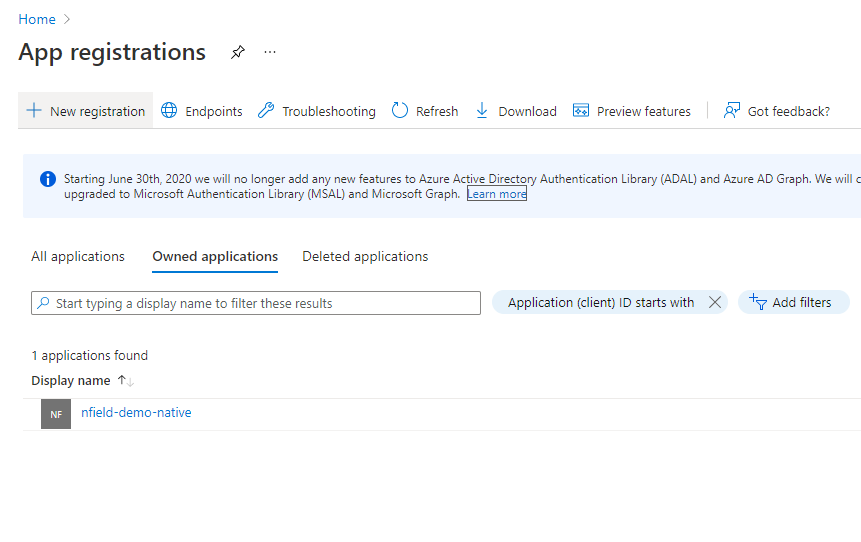
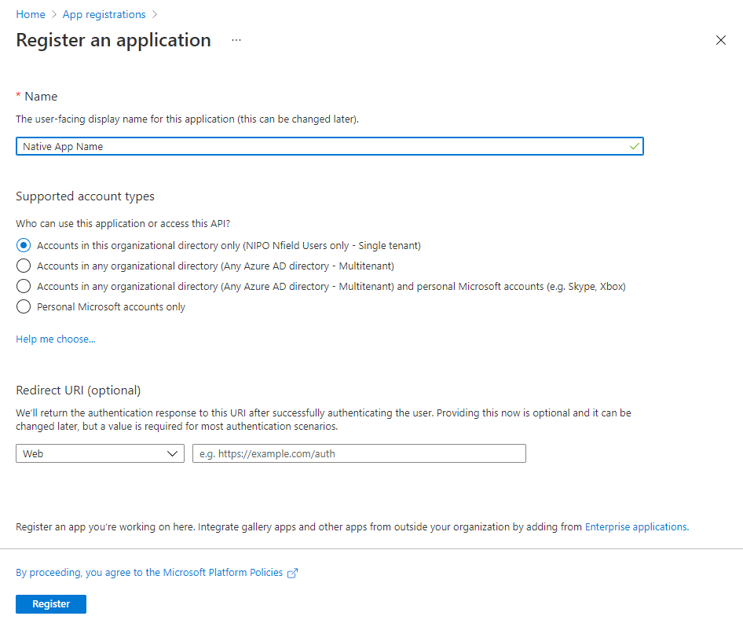

### _Take note of the appropriate settings_  

If you now look at the application overview a number of details are shown that will be used later.
Store the values of the application ID and the tenant ID.

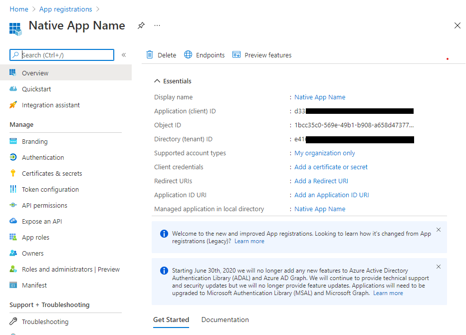

### _Add a platform for our Windows Forms application_

In order for our app to use this application registration you will have to tell AAD through which means it will authenticate.

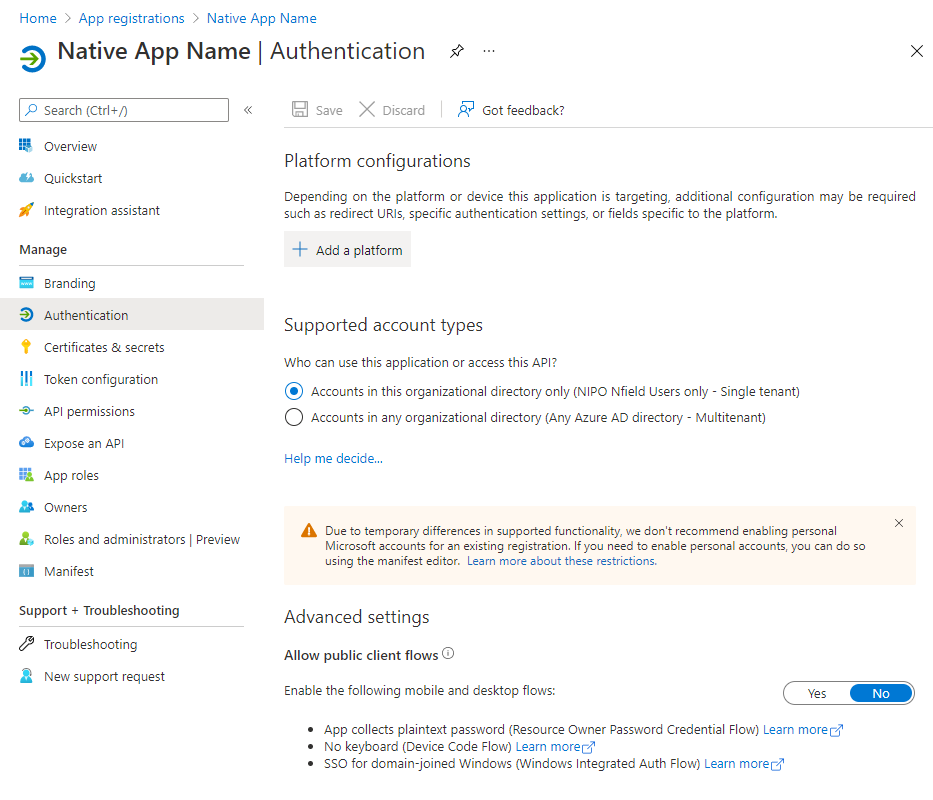

### _Add support for `Mobile and desktop applications`_
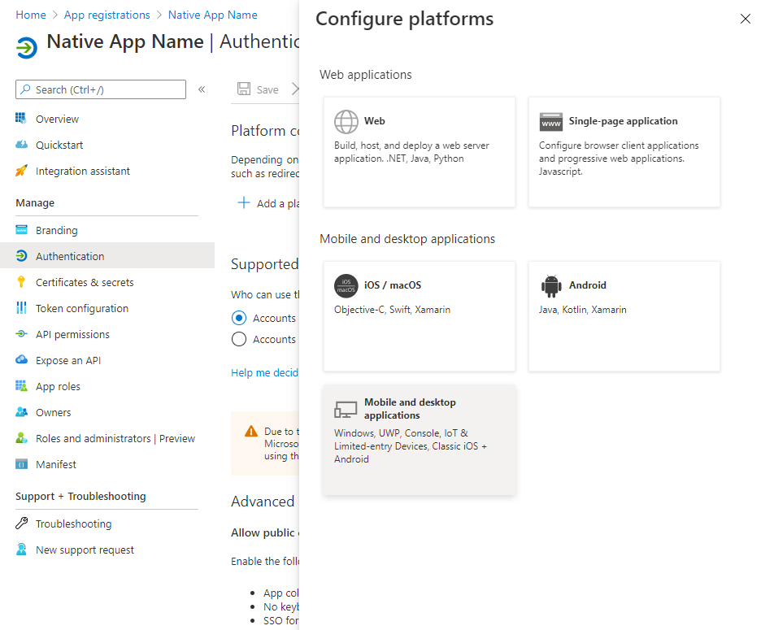

### _Setup `Redirect URIs`_

In order to support the ability to show the browser to select the account to use for logging in to Nfield the following URIs should be configured. The `http://localhost` URI is needed when using .Net Core, it will allow the application to capture the result of the login from the browser. For more information on redirect URIs, look [here](https://docs.microsoft.com/en-us/azure/active-directory/develop/scenario-desktop-app-registration#redirect-uris)

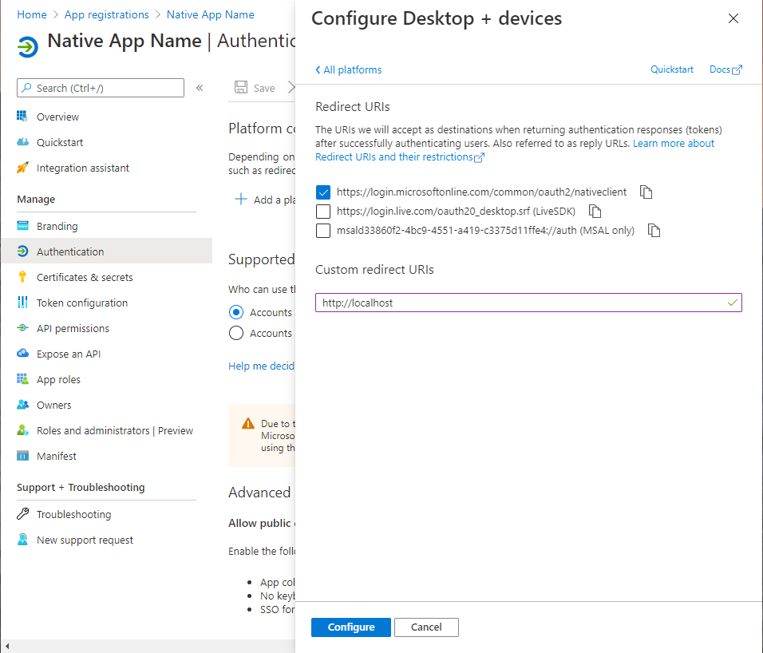

### _Check authentication details_

The authentication details should now look as following:
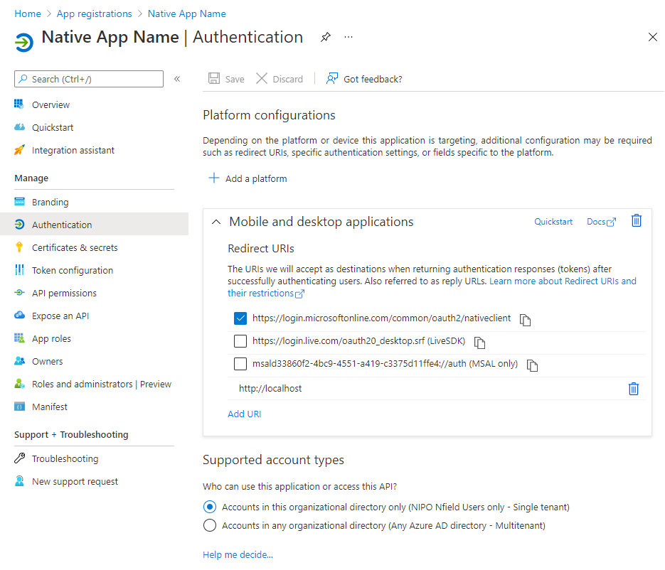

### _Now give the new application access to the Nfield API_

Now give the application permission to perform actions on the Nfield API on behalf of the user

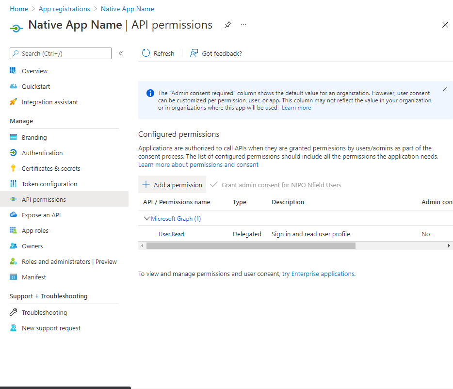

### _Select the Nfield Public API_

Look up the Nfield Public API in the `APIs my organizations uses` and store the its Application ID.

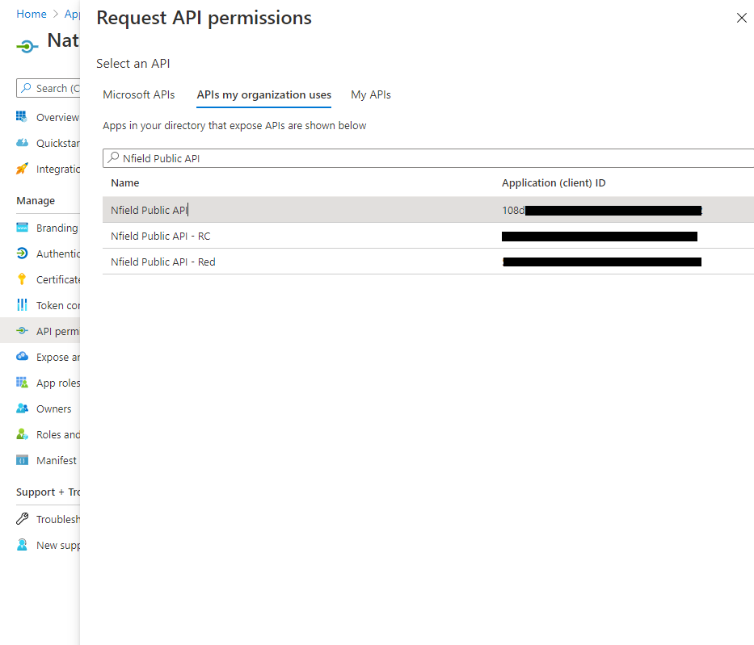

### _Add all Nfield permissions required by the application_
Select all the permissions that your application needs.
Please apply the principle of [least privilege](https://docs.microsoft.com/en-us/azure/active-directory/develop/secure-least-privileged-access) and select only what is strictly needed.
Note the `user_impersonation` will always be necessary.

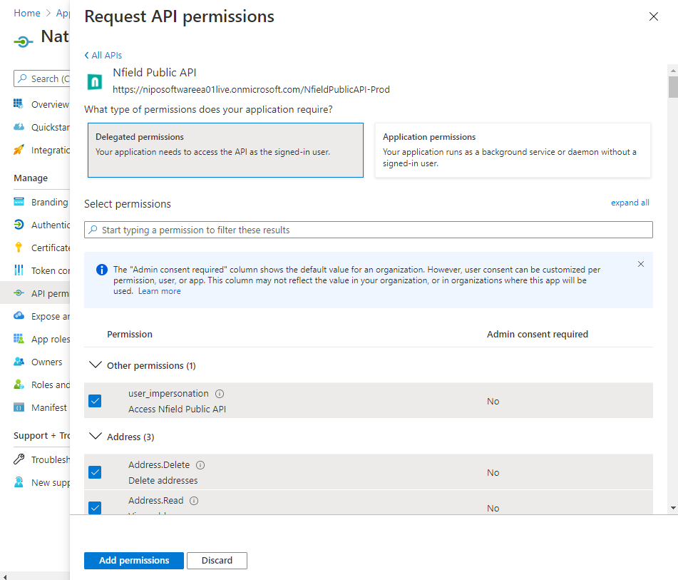

Our application is good to go and we should have the following information stored to use in the sample application:
- Client ID: this is the ID of the application we just registered
- Tenant ID: the ID of the tenant that we are signing into
- Nfield Public API Application ID: The ID of the Nfield Public API

These values will have to be added to `appsettings.json`.
Besides that the name of the domain should be added to this config.
It will be added as a header to each API call.
Luckily the Nfield SDK will take care of that for us.

## Application

Now that we have everything setup for our application, let's look at what we needed to do to use Azure AD for authentication.
The interaction between the application and Nfield is encapsulated in the NField class.

This class uses the MSAL library to interact with Azure AD.
It can be installed by installing the [Microsoft.Identity.Client](https://www.nuget.org/packages/Microsoft.Identity.Client/) NuGet package.

First we need to initialize a client:
```csharp
var client = PublicClientApplicationBuilder.Create(ApplicationConfiguration.Current.ClientId)
    .WithRedirectUri("http://localhost")
    .WithAuthority(AzureCloudInstance.AzurePublic, ApplicationConfiguration.Current.Tenant)
    .Build();
```
The reference to the redirect URI to `http://localhost` allows the application to retrieve the token that is returned by Azure AD from the [browser](https://docs.microsoft.com/en-us/azure/active-directory/develop/msal-net-web-browsers).

The method `AuthenticateAsync` contains the logic to acquire an access token from Azure AD.
```csharp
public async Task<AuthenticationResult> AuthenticateAsync(Action<string> statusCallback)
{
    var accounts = await ClientApp.GetAccountsAsync();
    var account = accounts.FirstOrDefault();

    try
    {
        return await ClientApp.AcquireTokenSilent(Scopes, account).ExecuteAsync();
    }
    catch (MsalUiRequiredException mure)
    {
        // Either we are not logged in or we are required to consent on giving the app permission
        statusCallback(mure.Message);

        // fall through to interactive login
    }

    var authResult = await ClientApp.AcquireTokenInteractive(Scopes)
        .WithAccount(account)
        .WithPrompt(Prompt.SelectAccount)
        .ExecuteAsync();

    return authResult;
}
```
First we try to get a token without user interaction (in case we have a valid refresh token).
If that fails, the code falls back to a method that will open the system browser and allows the user to select the account they want to use to login.

For more information on the various AcquireTokenXx methods, please refer to [this](https://docs.microsoft.com/en-us/azure/active-directory/develop/scenario-desktop-acquire-token?tabs=dotnet) document.

Please take note of the method that determines the name of the scopes.
```csharp
private static string CreateScope(string scope) => $"{ApplicationConfiguration.Current.NfieldApiApplicationId}/{scope}";
```
Nfield only supports scopes based on the Nield Public API application ID.
The name as presented in the permissions UI in the Azure portal cannot not be used.

Now after launching the application and logging in for the first time the user is asked to [consent](https://docs.microsoft.com/en-us/azure/active-directory/develop/v2-permissions-and-consent) to giving access to the application. For the sample application the screen will look like this:

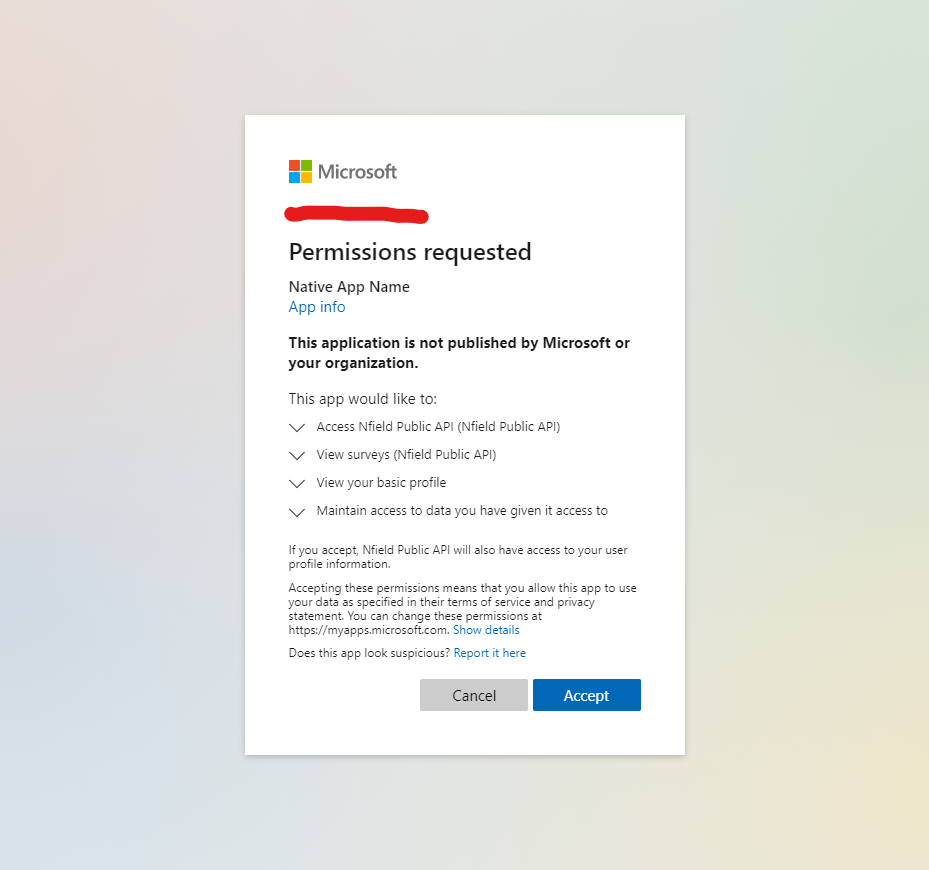

After giving consent the user should be presented with a screen that shows the surveys in the domain.
