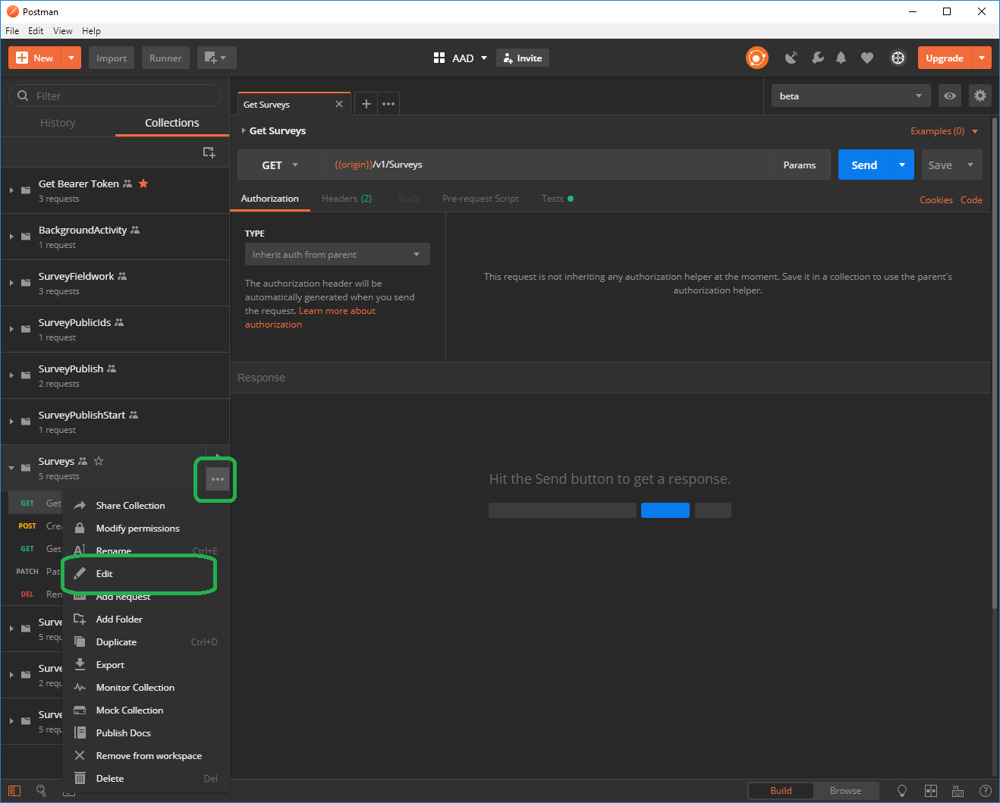
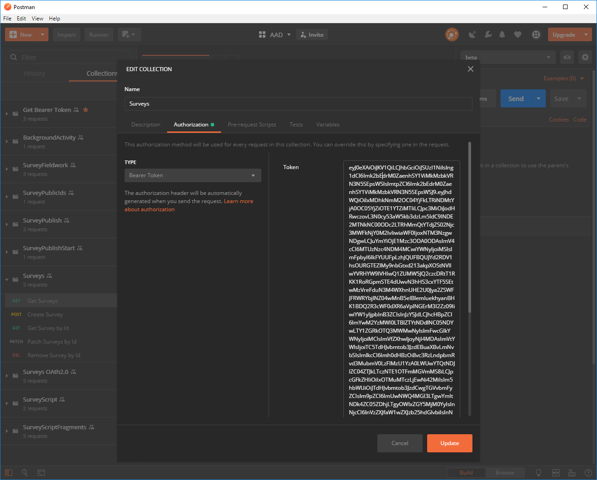
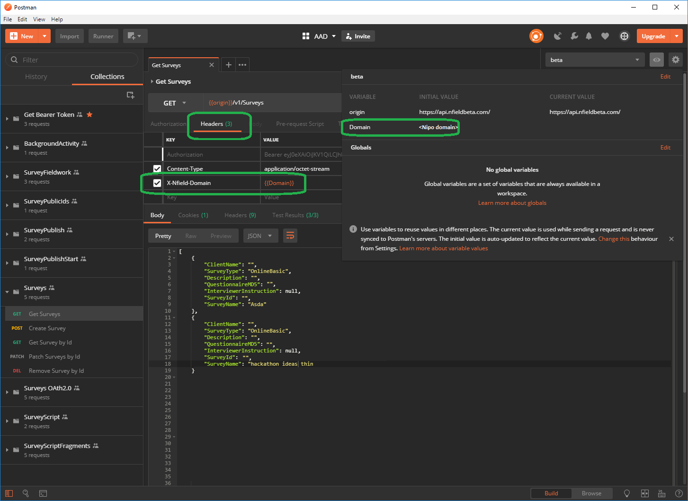

# AAD Authentication

We recently added support for AAD (Office 365) authentication to the Nfield API. To
use this from within NIPO, you can follow these steps.

## Using Postman

The collections in this folder use AAD Authentication.
On the `Authorization` tab of each request, the authorization type is set to `Inherent auth from parent`.
In the collection folder, click `...` and then `Edit` to edit the collection, see screenshot below.

*Figure 1. Edit the collection*

On the `Authorization` tab, the option `Bearer Token` is selected.
In the `Token` textbox, you should paste the token you got from AAD using e.g. the [MSAL.NET](https://docs.microsoft.com/en-us/azure/active-directory/develop/msal-net-initializing-client-applications) library. The inputs to this library are your own application id, its secret (in case of a backend app) and the application id (resource) of the Nfield Public Api.

*Figure 2. Paste the Bearer Token*

You can now update and close the collection.

## Access

On the `Headers` tab of the request, there should be an entry with key `X-Nfield-Domain` and value `{{Domain}}`.
Verify in the `Environment quick look` (the eye ball in the upper right corner) if the environment contains a variable for `Domain`. 

*Figure 3. Paste the Bearer Token*
