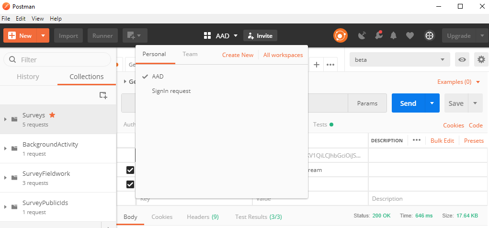

# AAD Authentication

We recently added support for AAD (Office 365) authentication to the Nfield API. To
use this from within NIPO, you can follow these steps.

If you want to use both authentication methods (Classic And ADD) in your local Postman, then you can create a separate workspace for each method.

*Figure 1. Postman with workspaces for each authentication method*

## Using Postman

The collections in this folder use AAD Authentication.
On the `Authorization` tab of each request, the authorization type is set to `Inherent auth from parent`.
In the collection folder, click `...` and then `Edit` to edit the collection, see screenshot below.

*Figure 2. Edit the collection*

On the `Authorization` tab, the option `Bearer Token` is selected.
In the `Token` textbox, you should paste the token you got from AAD using e.g. the [MSAL.NET](https://docs.microsoft.com/en-us/azure/active-directory/develop/msal-net-initializing-client-applications) library. The inputs to this library are your own application id, its secret (in case of a backend app) and the application id (resource) of the Nfield Public Api.

*Figure 3. Paste the Bearer Token*

You can now update and close the collection.

## Access

On the `Headers` tab of the request, there should be an entry with key `X-Nfield-Domain` and value `{{Domain}}`.
Verify in the `Environment quick look` (the eye ball in the upper right corner) if the environment contains a variable for `Domain`. 

*Figure 4. Paste the Bearer Token*
