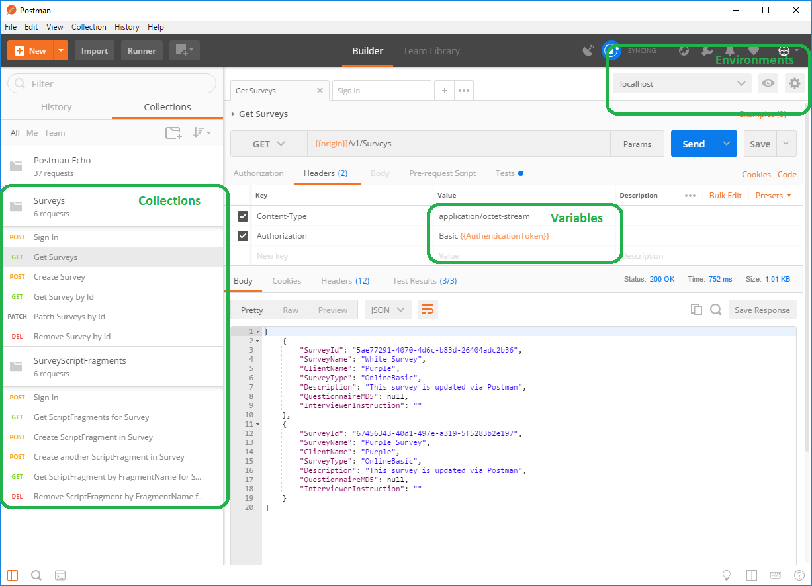

## Postman

Postman is a tool for working with APIs. It has a lot of nice features: 

* Collections: group API requests together so you find them quickly (instead of scrolling through the History list)
* Environments: easily switch between production, live and development environments
* Variables: store for example surveyid from a request and store it in a variable so you can use it in subsequent API requests.  
* Tests: check status codes and verify responses (e.g. check if all surveys have a name)
* Automate: run a collection for repetitive tasks (sign in, create survey, upload script, publish survey, start fieldwork)
* Generate code: postman can even generate code based on a request

*Figure 1. Postman with Nfield API Collections*

## Install and import
You can download the free Postman App at https://www.getpostman.com/. 

After installing the Postman app, you can import the collections via the import button in the upper left corner. You can directly import the collections via a link or you can download them from this GitHub folder and then import them into Postman. 
The environment files should be imported via the manage environment section in the upper right corner of Postman (you have to download them first from this GitHub folder). If you create your own environment, make sure to add a key-value pair for origin. The origin is the url of the api, this is already filled in for the production-EU and beta environment. 

## Authenticate
The traditional way of authenticating is by adding the domain, username and password in the body section of the `SignIn` request. After this, you are authenticated and you can run other requests. For authenticating by domain, username and password, you can use the collections from this folder. 

Alternatively, you can use [AAD (Office 365) authentication](Aad/Aad-authentication.md). For authenticating by AAD, you can use the collections in the subfolder Aad. 

If you would like to use the two methods of authentication, you can create a separate workspace for each method. 

*Figure 2. Postman with workspaces for each authentication method*
