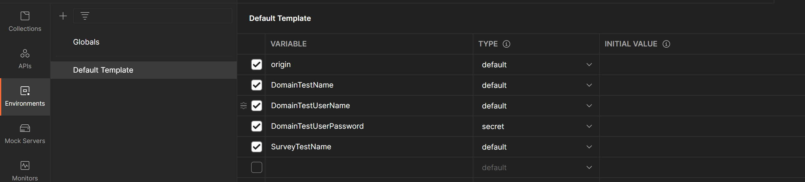
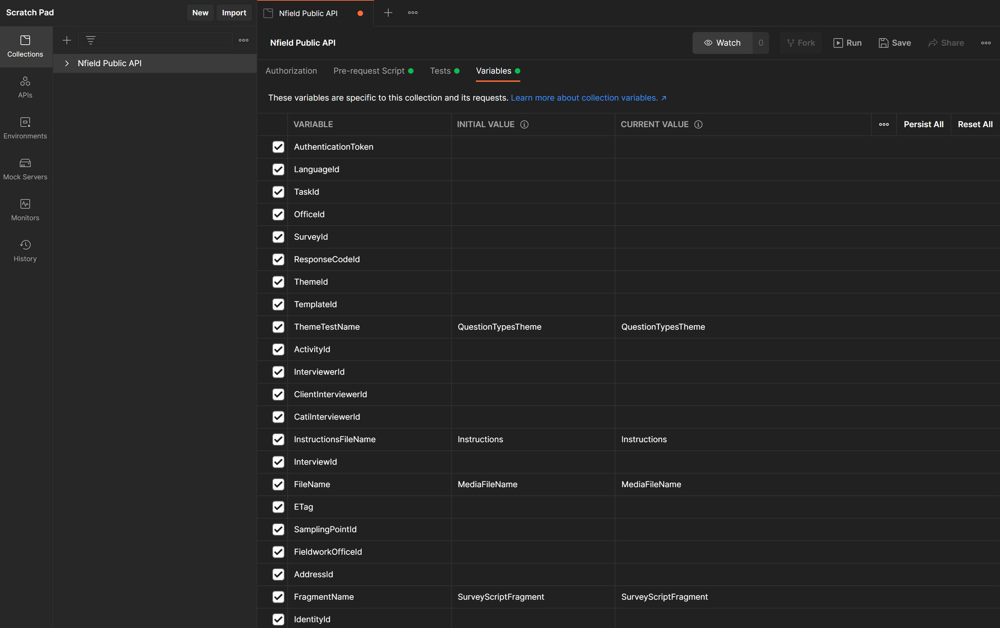
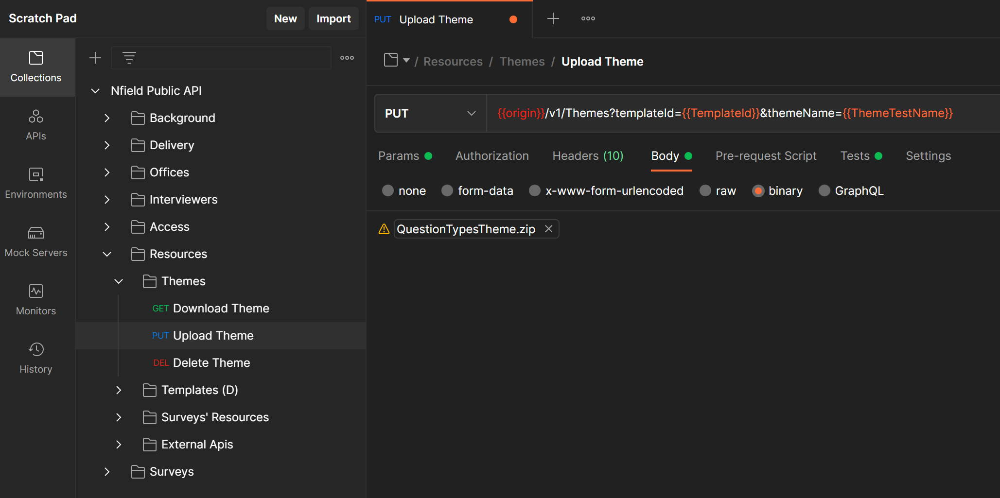

# Postman

Postman is a tool for working with APIs. It has a lot of nice features: 

* Collections: group API requests together so you find them quickly (instead of scrolling through the History list)
* Environments: easily switch between production, live and development environments
* Variables: store for example surveyid from a request and store it in a variable so you can use it in subsequent API requests.  
* Tests: check status codes and verify responses (e.g. check if all surveys have a name)
* Automate: run a collection for repetitive tasks (sign in, create survey, upload script, publish survey, start fieldwork)
* Generate code: postman can even generate code based on a request

## Install and import

You can download the free Postman App at https://www.getpostman.com/. 

### Nfield Public API Collection

After installing the Postman app, you can import the `Nfield Public API` collection via the import button in the upper left corner. You can directly import the collections via a link or you can download them from this GitHub folder and then import them into Postman. 

### Setup Environment

The [Environment Template file](./Environment/DefaultTemplate.postman_environment.json) can be imported via the manage environment section in the upper right corner of Postman (you have to download them first from this GitHub folder). 

To create your own environment, make sure to add a key-value pair for:

- Origin. The origin is the url of the api. 
    - EU: https://api.nfieldmr.com/
    - AM: https://capiam.nfieldmr.com/
    - APAC: https://capiap.nfieldmr.com/
    - CN: https://capicn.nfieldcn.com/
- DomainTestName: `SignIn` Domain name
- DomainTestUserName: `SignIn` User name
- DomainTestUserPassword: `SignIn` User password
- SurveyTestName (Optional): Name of a known domain survey. Used to fill automatically the SurveyId collection variable, in order to target your survey requests respect to a specific survey.

*Figure 1. Postman environment*

__Default Survey (Optional)__
In case you defined the environment `SurveyTestName` the collection `Pre-request script` is ready to automatically get and set in the collection variables the SurveId for this survey (If exists), you can also change it manually from the collection variables.

---

## Authentication

The collection `Pre-request script` is ready to automatically login and obtain an authentication token, which will be used on all calls. When the token expires, you'll get a `401 Unauthorized` response and the token will be invalidated, in the next request the `Pre-request script` will get a new Token (You only need repeat the request).

_If you want to SigIn manually you can use `Access -> Sign In` call._

__AAD Authenticate__.
Alternatively, you can use [AAD (Office 365) authentication](Aad/Aad-authentication.md). For authenticating by AAD, you can use the collections in the subfolder Aad.

---

## Collection Variables

### IDs Variables
Usually the `Set, Create, Update` or `Add` tests will set the Id variables when you perform them to be able to use them in other requests. Moreover, you can define them manually obtaining the identifiers of the listing calls.
### Custom Variables
Used for request's parameters that aren't Ids, have valid default values, but can be customized.
### Internal Variables
Used internally to define the defaults selected __(do not alter these variable)__.

*Figure 2. Colection variables*

---

## Upload Files
Some Calls need a binary body, in the `Postman/ExampleFiles` folder there are example files that can be used. 
Postman collection stores the local file path so is necessary to re-select the file to set your local file path properly.

*Figure 3. Postman binary file example*
